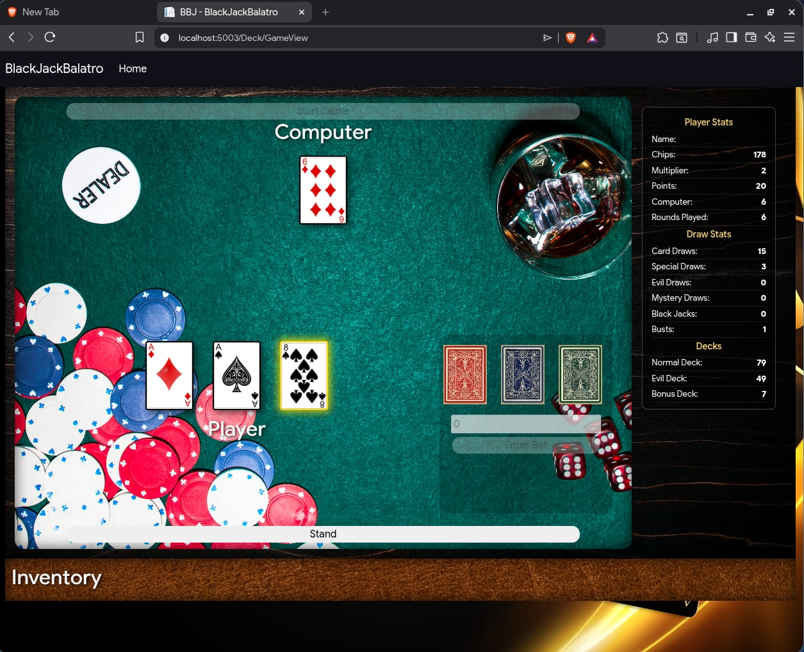

# Black Jack (Inspired by Balatro)

With a mix of rogue-like elements and the popular card game **Black Jack**, this web app creates a new experience for users wanting to play a card game with a twist.

## Gameplay

   
This web app utilizes api calls to refresh and update each frame to accurately display current game stats.
   

   
The rules are slightly different from the original Black Jack Game
  1. At game start, both computer and player draw initial cards.
  2. The player then needs to enter a bet in order to hit or stand.
  3. There are three decks to choose from when hitting. Each deck has different effects to alter the gameplay
   

   
  4. The player loses a round if either the computer scores higher than the player without busting or the player busts themselves.
  5. The player loses the game if:
     - They run out of tokens
     - They run out of normal cards to draw
   

    

## Development

This web app is made based on the **ASP .NET MVC** Framework and utilizes **Javascript** and **CSS** for dynamic configuration.

### THIS WEBSITE DOES NOT PROMOTE GAMBLING AND IS MEANT TO BE AN ACADEMIC REQUIREMENT

