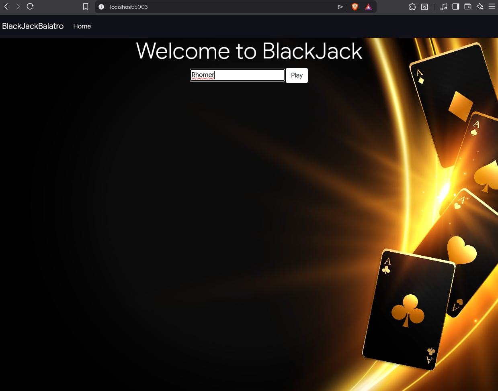
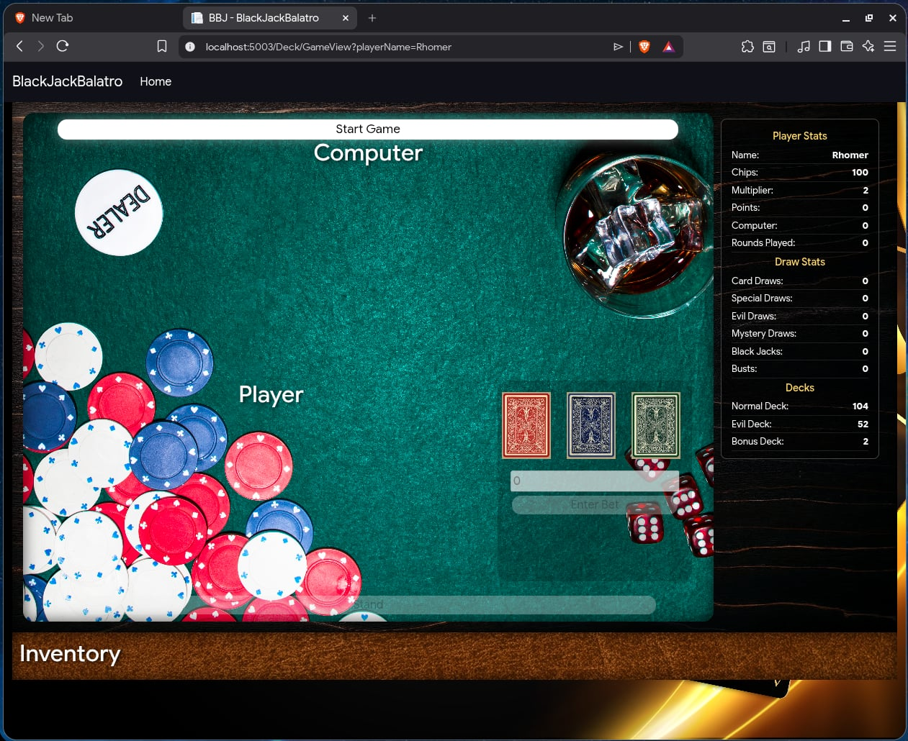
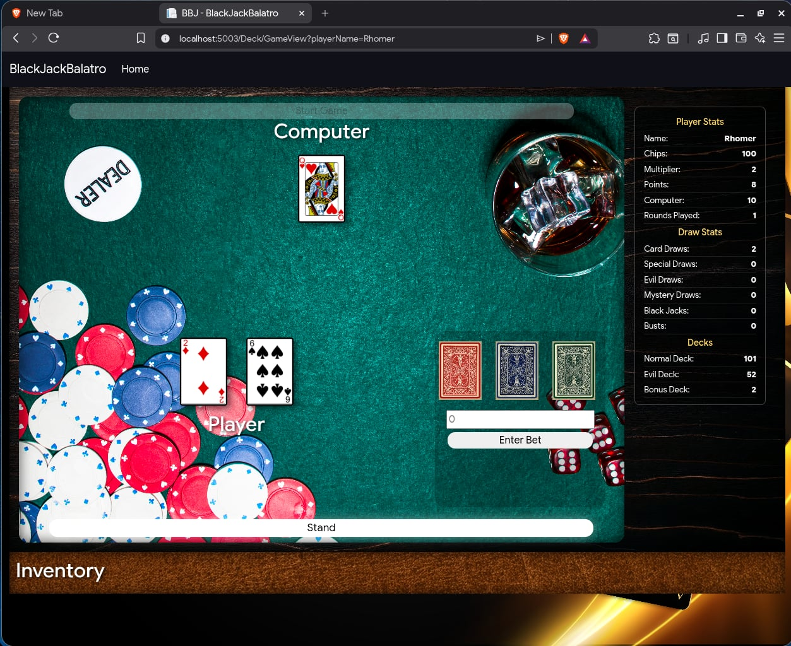

# Black Jack (Inspired by Balatro)

With a mix of rogue-like elements and the popular card game Black Jack, this web app creates a new experience for users wanting to play a card game with a twist.

## Gameplay

 
- This web app utilizes api calls to refresh and update each frame to accurately display current game stats.
 

 
- The rules are slightly different from the original Black Jack Game
  1. At game start, both computer and player draw initial cards.
  2. The player then needs to enter a bet in order to hit or stand.
  3. There are three decks to choose from when hitting. Each deck has different effects to alter the gameplay

 

